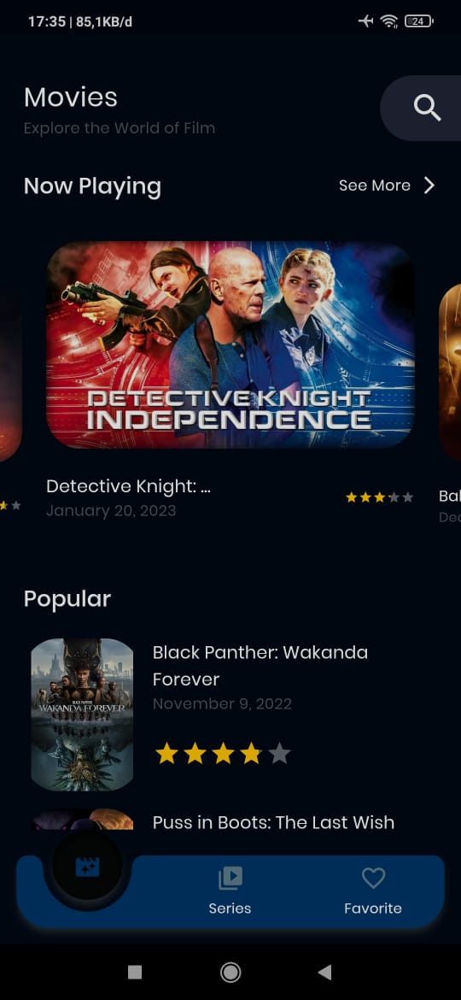
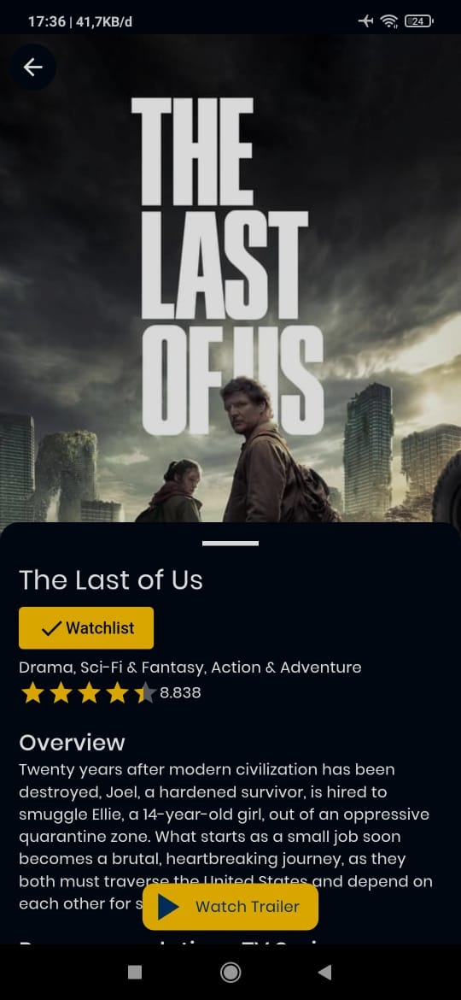
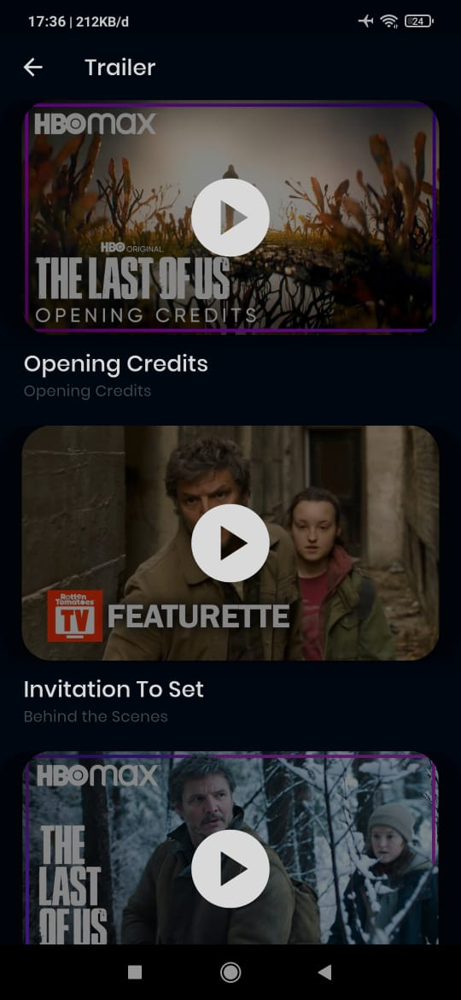
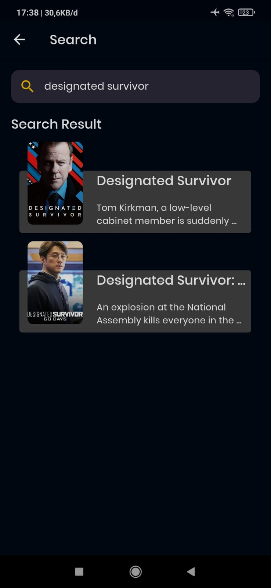

# Moflix - Movie and TV Series Catalog App

Moflix is a captivating movie and TV series catalog app, developed as a submission for the Dicoding Flutter Developer Expert course. With its extensive collection of films and TV shows, easy search functionality, and trailers to assist with decision-making, Moflix offers a delightful entertainment experience.

## Codemagic CI

## Features

- 🎥 Browse an extensive collection of movies and TV series.
- 🔍 Easily search for your favorite titles.
- 🎬 Watch trailers to help you decide what to watch next.

## Tech Stack

Moflix utilizes the following technologies:

- Flutter: Flutter is a powerful cross-platform framework for building beautiful and high-performance applications. It allows for the creation of visually appealing user interfaces and enables seamless development for both iOS and Android platforms.
- HTTP: The HTTP package is used for making API calls and handling network requests in Flutter applications. It simplifies the process of fetching data from external sources, such as the TMDB API in the case of Moflix.
- flutter_bloc: flutter_bloc is a state management library for Flutter applications that follows the BLoC (Business Logic Component) architectural pattern. It helps to separate business logic from the user interface, making the codebase more maintainable and testable.
- sqflite: sqflite is a Flutter package that provides a simple and efficient way to interact with SQLite databases. In Moflix, it is used to store and retrieve locally cached data, such as user favorites or previously viewed movies and TV series.
- google_fonts: google_fonts is a Flutter package that simplifies the integration of custom fonts from the Google Fonts collection. It allows for easy customization of typography in the app, enhancing the visual experience.
- bloc_test: bloc_test is a package that provides utilities for testing BLoC components in Flutter applications. It enables writing unit tests to ensure the correctness and reliability of the app's business logic.

## Architecture

Moflix follows the Clean Architecture principles. It promotes separation of concerns and maintainability by dividing the codebase into layers: presentation, domain, and data. This architecture allows for easier testing, modularity, and scalability of the application.

## Data Source

Moflix utilizes the TMDB (The Movie Database) API as its primary data source. The API provides a vast collection of movie and TV series information, including details, ratings, genres, and trailers. By integrating with the TMDB API, Moflix ensures an up-to-date and comprehensive catalog of movies and TV shows.

## Screenshots

## Getting Started

To run Moflix on your local machine, follow these steps:

1. Clone the repository: `git clone https://github.com/vikoms/dicoding_flutter_final_submission.git`
2. Install Flutter: [Flutter Installation Guide](https://flutter.dev/docs/get-started/install)
3. Install dependencies: `flutter pub get`
4. Run the app: `flutter run`

Please note that additional setup and configuration may be required, depending on your development environment.

## Contributions

Contributions to Moflix are welcome! If you encounter any issues or would like to suggest improvements, please open an issue or submit a pull request on the project's GitHub repository.

Before contributing, please review the [contribution guidelines](CONTRIBUTING.md) to ensure a smooth collaboration process.

## License

Moflix is open-source and is licensed under the [MIT License](LICENSE).

## Download

You can download the Moflix app from the Google Play Store:

## Contact

If you have any questions or inquiries about Moflix, feel free to reach out to me at [VikoMS95@gmail.com](mailto:VikoMS95@gmail.com).

---

Thank you for your interest in Moflix! Enjoy exploring a vast world of movies and TV series. Happy watching!
